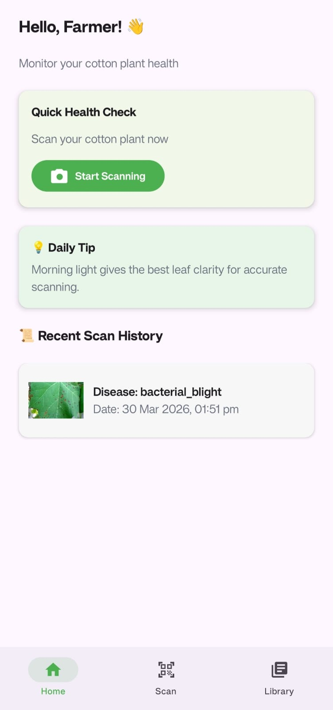
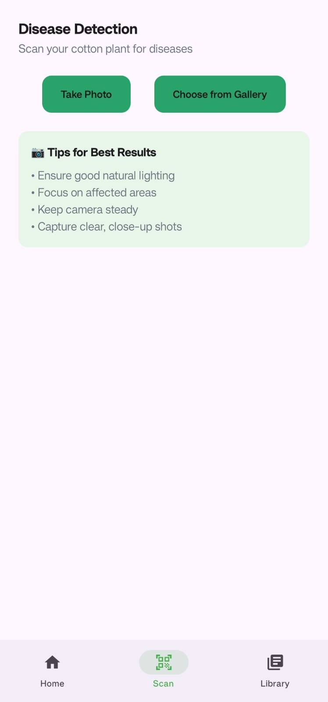
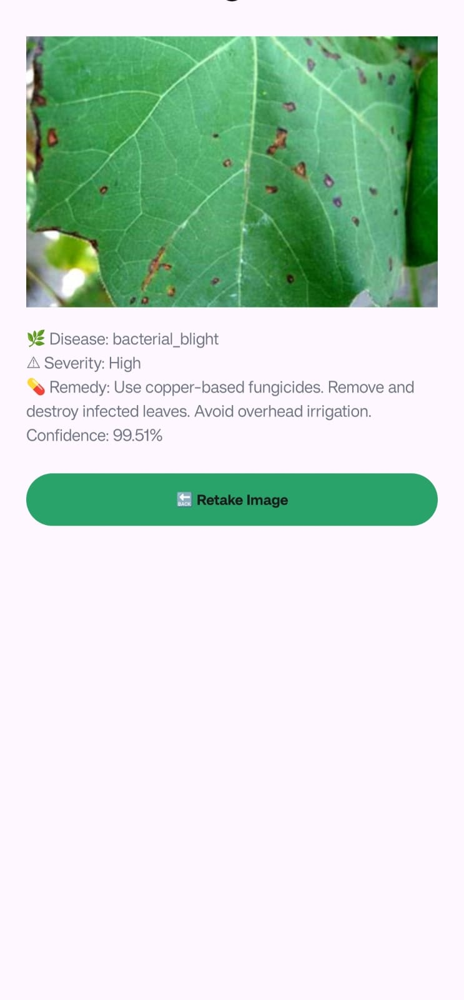
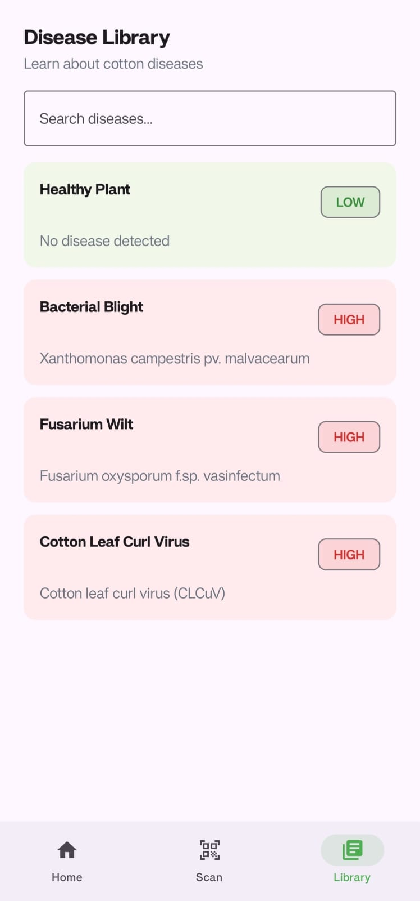
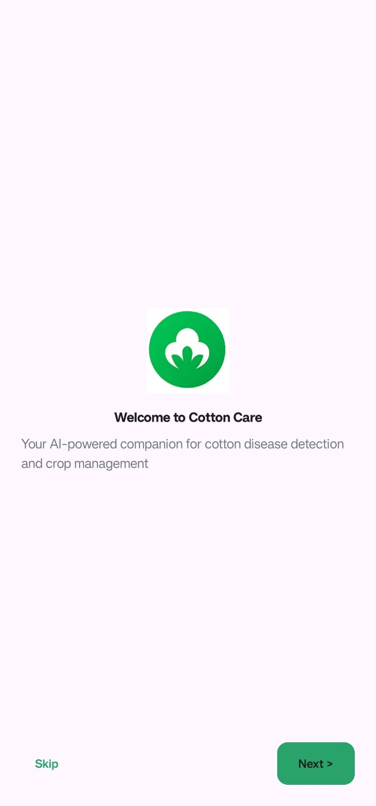

# 🌿 CottonCare — AI-Based Cotton Disease Detection App


An **offline AI-powered Android application** that detects cotton leaf diseases using **TensorFlow Lite** and provides **instant diagnosis with remedies**, even without internet access.

---

## 🚀 Problem Statement

Farmers often lack access to **fast, reliable, and affordable crop diagnosis tools**, especially in rural areas with poor internet connectivity.

---

## 💡 Solution

CottonCare brings **AI directly to mobile devices**, enabling:

* ⚡ Real-time disease detection
* 📴 Fully offline usage
* 🌱 Instant actionable remedies

---

## ✨ Key Features

* 📷 Capture or upload cotton leaf images
* 🤖 On-device AI prediction (no API required)
* 📊 Confidence-based result validation
* ⚠️ Unknown detection for invalid inputs
* 💊 Remedy suggestions for each disease
* 🧠 ML Kit input validation (rejects non-leaf images)
* 📚 Built-in disease knowledge base
* 🕒 Local scan history tracking

---

## 📱 App Screenshots

### 🏠 Home Screen



### 📷 Scan Screen



### 🤖 Prediction Result



### 📚 Disease Library



### 🚀 Onboarding Experience



---

## 🧠 AI Model Details

* Model: **MobileNetV2 (Transfer Learning)**
* Input Size: **224 × 224 × 3**
* Framework: **TensorFlow → TensorFlow Lite**
* Deployment: **Fully on-device (offline inference)**

### Supported Classes

* Fusarium Wilt
* Bacterial Blight
* Cotton Leaf Curl Virus
* Healthy Plant

---

## ⚙️ System Architecture

```text
Image Input (Camera / Gallery)
        ↓
ML Kit Validation
        ↓
Image Preprocessing (Resize 224x224, Normalize)
        ↓
TensorFlow Lite Model (MobileNetV2)
        ↓
Prediction Output (Class + Confidence)
        ↓
Business Logic Layer
   - Confidence Threshold Handling
   - Unknown Detection
   - Severity Mapping
        ↓
UI Layer (Jetpack Compose)
        ↓
Local Storage (Scan History)
```

---

## ⚙️ Key Engineering Decisions

### 🔹 Why TensorFlow Lite?

* Enables **offline inference**
* Faster performance on mobile
* No dependency on external APIs

---

### 🔹 Why MobileNetV2?

* Lightweight and optimized for mobile
* Good trade-off between accuracy & speed

---

### 🔹 Confidence Threshold Handling

* < 70% → Low confidence warning
* 70–85% → Caution message
* > 85% → Strong prediction

👉 Prevents misleading results and improves user trust

---

### 🔹 ML Kit Validation

* Filters non-leaf inputs (faces, random objects)
* Improves prediction reliability

---

### 🔹 Offline-First Design

* Works without internet
* Ensures privacy + speed
* Ideal for rural deployment

---

## 📊 Example Prediction Output

* Disease: **Bacterial Blight**
* Severity: **High**
* Confidence: **99.51%**
* Remedy: Use copper-based fungicides, remove infected leaves, avoid overhead irrigation.

---

## 🛠️ Tech Stack

### 📱 Mobile

* Kotlin
* Jetpack Compose
* CameraX
* ML Kit

### 🤖 Machine Learning

* TensorFlow / Keras
* MobileNetV2
* TensorFlow Lite

---

## ⚡ Installation

```bash
git clone https://github.com/shrinidhinaik23/CottonCare.git
cd CottonCare
```

Open in **Android Studio** and run the application.

---

## ⚠️ Limitations

* Limited dataset size
* Performance depends on image quality
* Cannot detect unseen diseases
* Offline-only (no cloud sync)

---

## 🚀 Future Improvements

* Expand dataset for higher accuracy
* Add more disease categories
* Real-time camera detection
* Multilingual farmer support
* Optional cloud-based analytics

---

## 👨‍💻 Author

**Shrinidhi Naik**

---

